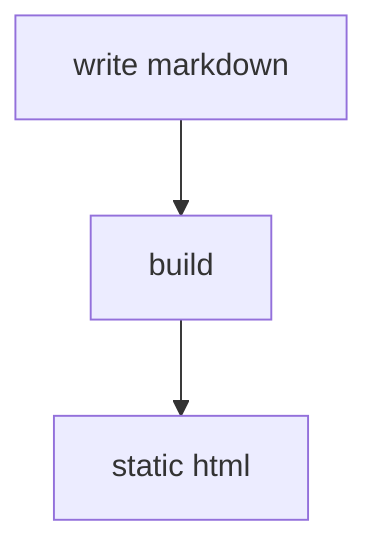

# pages

minimal static site generator for a personal site. built on deno, markdown, and
a tiny amount of custom glue.

## features

- markdown pages with frontmatter
- ascii mermaid rendering for diagrams
- per-page og images (1200x630 png)
- theme switcher (light/dark)
- raw .md links for every page
- sitemap.xml, robots.txt, llms.txt, llms-full.txt
- safe html escaping + strict url/path handling
- github pages ready (project site under /pages)

## quick start

```
deno task build
deno task serve
```

## config

- `config.yaml` controls site metadata, paths, and theme behavior
- schema: `config.schema.json`

## structure

```
pages/        # markdown + static assets
src/          # ssg code
dist/         # build output
```

## deploy (github pages)

this repo is published at:

```
https://ranadeep.in/pages
```

set `url` in `config.yaml` to that value so canonical links and assets resolve
correctly.

## examples

### frontmatter

```yaml
---
title: "example page"
description: "short summary"
tags: [docs, demo]
date: 2026-02-07
---
```

### mermaid (ascii rendering)



### code blocks with filenames

```ts
#! file: hello.ts
export function hello(name: string) {
  return `hello ${name}`;
}
```

### tables

| feature        | status |
| -------------- | ------ |
| markdown pages | yes    |
| og images      | yes    |
| raw .md        | yes    |

### alerts

> [!NOTE]
> markdown alerts render as styled callouts.

### raw markdown

- raw source for this page: `/index.md`

### og images

- generated at build time: `/assets/og-index.png`

### themes

- use the theme picker in the header to switch light/dark themes
