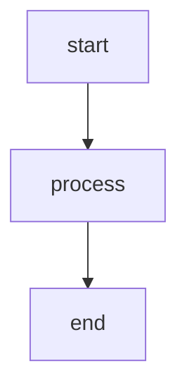

# markdown

pages uses github-flavored markdown with some extras.

## frontmatter

every page starts with yaml frontmatter:

```yaml
---
title: "page title"
description: "short summary for seo and og images"
tags: [docs, tutorial]
date: 2026-02-07
---
```

| field         | description                                                 |
| ------------- | ----------------------------------------------------------- |
| `title`       | page title (used in `<title>`, og image, h1 if not present) |
| `description` | meta description and og image subtitle                      |
| `tags`        | array of tags (optional)                                    |
| `date`        | publication date (optional)                                 |

## headings with anchors

all headings get auto-generated ids and clickable anchor links:

```markdown
## my section
```

renders as a heading you can link to: `/page#my-section`

## mermaid diagrams

fenced code blocks with `mermaid` language render as ascii art:

````

````

renders as:


## code blocks

standard fenced code blocks with syntax highlighting:

````
```ts
const x = 42;
```
````

### filename headers

add a filename to any code block with `#! file:`:

````
```ts
#! file: example.ts
export function greet(name: string) {
  return `hello ${name}`;
}
```
````

renders as:

```ts
#! file: example.ts
export function greet(name: string) {
  return `hello ${name}`;
}
```

## tables

standard gfm tables:

```markdown
| column a | column b |
| -------- | -------- |
| value 1  | value 2  |
```

| column a | column b |
| -------- | -------- |
| value 1  | value 2  |

## alerts

github-style alerts for callouts:

```markdown
> [!NOTE]
> this is a note.

> [!WARNING]
> this is a warning.

> [!TIP]
> this is a tip.
```

> [!NOTE]
> this is a note.

> [!WARNING]
> this is a warning.

> [!TIP]
> this is a tip.

## raw markdown links

every page automatically gets a link to its raw `.md` source in the footer.

---

see also:

- [features](/features) - full feature list
- [configuration](/config) - config.yaml reference
- [deployment](/deploy) - github pages setup
